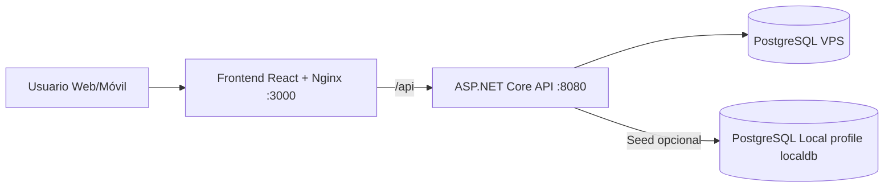

# Andromeda Ticketing Platform

Documentación técnica completa del proyecto `Copia de asp_backend`.

Este README explica la arquitectura, el propósito de cada módulo, cómo funciona el flujo completo de autenticación y escaneo, qué hace cada archivo importante, cómo levantar el sistema con Docker, cómo se conecta a la VPS y qué comportamientos están habilitados actualmente por rol.

## 1. Objetivo del Proyecto

Este sistema está diseñado para operación de ingreso a eventos con QR:

- Permite login con JWT para personal autorizado.
- Permite elegir un evento activo para operación de escaneo.
- Escanea y valida tickets por cámara o lector físico.
- Muestra información del ticket: propietario, silla, evento y estado.
- Registra trazabilidad de escaneos (correctos, fraude, ilegal, no encontrado, etc.).

## 2. Estado Funcional Actual

- Roles con acceso al panel: `employee`, `admin`, `superadmin`.
- `employee` y `admin`: acceso operativo completo (dashboard + escaneo).
- `superadmin`: acceso habilitado en modo lectura (sin datos operativos y sin escaneo, por decisión temporal).
- El sistema exige credenciales válidas para entrar.
- Se muestra quién inició sesión y qué evento está activo para el escaneo.

## 3. Arquitectura General



## 4. Estructura de Carpetas (relevante)

- `Controllers/`: endpoints HTTP (auth, tickets, events).
- `Data/`: contexto EF Core y sembrado inicial.
- `Models/`: entidades del dominio/tablas.
- `Services/`: reservada para capa de servicios (actualmente vacía).
- `frontend/`: app React + estilos + escáner.
- `docker-compose.yml`: orquestación de contenedores.
- `.env`: variables de entorno activas de despliegue.
- `.env.example`: plantilla de variables.

## 5. Backend (ASP.NET Core 10)

### 5.1 Startup y pipeline

Archivo: `Program.cs`

Qué hace:

- Registra controladores, Swagger y EF Core con Npgsql.
- Configura CORS desde `Cors:AllowedOrigins`.
- Configura autenticación JWT (issuer, audience, key, lifetime y firma).
- Configura autorización por roles.
- Ejecuta inicialización de base de datos con reintentos (`EnsureCreated + DbInitializer.SeedAsync`).
- Activa middleware:
  - `UseSwagger`
  - `UseCors`
  - `UseAuthentication`
  - `UseAuthorization`
  - `MapControllers`

Detalle importante:

- El bloque de reintentos al arrancar evita fallas cuando la base aún no responde inmediatamente.

### 5.2 Controlador de autenticación

Archivo: `Controllers/AuthController.cs`

Endpoints:

- `POST /auth/login`
  - Valida email/contraseña con `BCrypt.Verify`.
  - Busca rol activo desde tabla `employees + roles`.
  - Emite JWT con claims:
    - `sub` (user id)
    - `email`
    - `role`
    - `employeeId` (si existe)
  - Devuelve además `activeEvent` (evento próximo/activo de referencia).

- `GET /auth/me`
  - Requiere token.
  - Devuelve información del usuario autenticado y `activeEvent`.

- `POST /auth/register`
  - Crea usuario con hash BCrypt.
  - No asigna automáticamente rol de empleado/admin.

### 5.3 Controlador de tickets (núcleo operativo)

Archivo: `Controllers/TicketsController.cs`

Autorización:

- `[Authorize(Roles = "employee,admin,superadmin")]`

Comportamiento por rol:

- `employee` y `admin`: operación completa.
- `superadmin`: modo lectura temporal.

Endpoints:

- `GET /tickets/events`
  - Lista eventos disponibles para selector de operación.

- `GET /tickets/dashboard?eventId={guid}`
  - Construye contexto de sesión (`ScannerSession`): usuario, rol, empleado, evento activo.
  - Si rol = `superadmin`: retorna dashboard vacío por política actual.
  - Para operación normal:
    - filtra escaneos por empleado (si aplica)
    - filtra por evento activo
    - calcula métricas:
      - total escaneados
      - escaneados hoy
      - válidos
      - fraude
      - ilegal
    - retorna últimos 50 escaneos con detalle.

- `POST /tickets/scan`
  - Entrada: `qrCode`, `eventId` opcional.
  - Si rol = `superadmin`: responde `READ_ONLY_ROLE` y no escanea.
  - Busca ticket por QR.
  - Si no existe: registra scan `NOT_FOUND`.
  - Si ticket pertenece a otro evento activo: registra `WRONG_EVENT`.
  - Si existe y evento coincide, valida estado:
    - `VALID` -> permite ingreso y cambia ticket a `USED`
    - `USED` -> `ALREADY_USED`
    - `FRAUD` -> `FRAUD`
    - `ILLEGAL` -> `ILLEGAL`
    - otro -> `INVALID`
  - Devuelve siempre contexto de sesión + detalle del ticket cuando exista.

### 5.4 Controlador de eventos

Archivo: `Controllers/EventsController.cs`

Endpoints:

- `GET /events`: lista eventos.
- `GET /events/{id}`: detalle de evento + áreas.
- `POST /events/{id}/seats/lock`: reserva sillas si están disponibles.

### 5.5 DTO compartido

Archivo: `Controllers/SharedDtos.cs`

- Define `EventContext` para reutilizar estructura de evento activo entre controladores.

### 5.6 Acceso a datos y seed

Archivo: `Data/AppDbContext.cs`

Qué hace:

- Mapea entidades/tablas y relaciones EF Core (PostgreSQL).
- Configura claves, índices, defaults y constraints según esquema existente.

Archivo: `Data/DbInitializer.cs`

Qué hace:

- Sembrado inicial solo si no existen usuarios.
- Crea rol `employee` y datos demo de evento/tickets.
- Genera casos de prueba para escaneo:
  - ticket válido
  - ticket fraude
  - ticket ilegal

Nota de fechas:

- Se usa `DateTimeKind.Unspecified` para compatibilidad con columnas `timestamp without time zone` en PostgreSQL.

## 6. Modelos de Dominio (`Models/`)

### 6.1 Modelos principales del flujo de tickets

- `User.cs`: usuario del sistema (email, hash, perfil).
- `Role.cs`: catálogo de roles.
- `Employee.cs`: vincula usuario con rol operativo.
- `Event.cs`: evento principal.
- `EventArea.cs`: zona/área del evento.
- `AreaSeat.cs`: silla física y estado.
- `Ticket.cs`: ticket con QR y estado.
- `TicketScan.cs`: bitácora de escaneo.

### 6.2 Modelos de soporte existentes en esquema

- `Notification.cs`: notificaciones por usuario.
- `Pqr.cs` y `PqrsResponse.cs`: flujo PQR/PQRS.
- `Metric.cs`: métricas operativas.
- `Permission.cs`: permisos por empleado.
- `EventSection.cs`: secciones de evento.
- `Session.cs`: sesiones persistidas (esquema heredado).

## 7. Frontend (React + Vite)

### 7.1 Entrada y enrutamiento

- `frontend/src/main.jsx`: monta React + Router + `AuthProvider`.
- `frontend/src/App.jsx`: rutas principales:
  - `/login`
  - `/dashboard` protegida

- `frontend/src/components/ProtectedRoute.jsx`:
  - redirige a login si no hay token.

### 7.2 Estado de sesión

- `frontend/src/context/AuthContext.jsx`:
  - guarda token y usuario en estado global.
  - persiste en `localStorage` (`andromeda_auth`).
  - expone `setSession()` y `logout()`.

### 7.3 Cliente API

- `frontend/src/api.js`:
  - `login(email, password)`
  - `getScanEvents(token)`
  - `getDashboard(token, eventId)`
  - `scanTicket(token, qrCode, eventId)`

Base API:

- Usa `VITE_API_BASE_URL` si existe.
- Por defecto usa `/api` (proxy Nginx al backend).

### 7.4 Pantallas

- `frontend/src/pages/LoginPage.jsx`
  - Login para `employee/admin/superadmin`.
  - Mensaje explícito de cierre de sesión para cambiar usuario.

- `frontend/src/pages/DashboardPage.jsx`
  - Muestra usuario, rol y evento activo.
  - Selector de evento de operación.
  - Métricas y tabla de escaneos.
  - Mensaje especial para `superadmin` en modo lectura.

- `frontend/src/pages/ScannerPage.jsx`
  - Muestra sesión activa (usuario/rol/evento).
  - Escáner por cámara con `html5-qrcode`.
  - Entrada manual compatible con lector físico (keyboard wedge).
  - Resultado de validación con detalle completo de ticket.

### 7.5 Estilo

- `frontend/src/styles.css`
  - Tema visual elegante con paleta:
    - `#001A6E`
    - `#074799`
    - `#009990`
    - `#E1FFBB`
  - Diseño responsive para escritorio y móvil.

## 8. Infraestructura Docker

### 8.1 Servicios

Archivo: `docker-compose.yml`

- `frontend`:
  - Nginx en `:3000`
  - sirve React build
  - proxy `/api` hacia backend

- `backend`:
  - ASP.NET Core en `:8080`
  - recibe connection string desde variables de entorno

- `db` (perfil opcional `localdb`):
  - PostgreSQL local en `:5433`
  - se activa solo con `--profile localdb`

### 8.2 Variables de entorno

Archivo: `.env`

Variables clave:

- `DB_HOST`, `DB_PORT`, `DB_NAME`, `DB_USER`, `DB_PASSWORD`
- `DB_CONN_SUFFIX` (para SSL options si la VPS lo requiere)
- `JWT_ISSUER`, `JWT_AUDIENCE`, `JWT_KEY`
- `CORS_ORIGIN_0`, `CORS_ORIGIN_1`

## 9. Conexión a VPS (modo actual)

Actualmente el backend está configurado para conectar a tu VPS PostgreSQL desde `.env`.

Cadena efectiva construida en `docker-compose`:

- `Host=${DB_HOST};Port=${DB_PORT};Database=${DB_NAME};Username=${DB_USER};Password=${DB_PASSWORD}${DB_CONN_SUFFIX}`

Si necesitas SSL obligatorio, agrega por ejemplo:

- `DB_CONN_SUFFIX=;SSL Mode=Require;Trust Server Certificate=true`

## 10. Flujo de Operación Completo

### 10.1 Login

- Usuario ingresa credenciales.
- Backend valida hash BCrypt.
- Backend devuelve JWT + rol + evento activo.
- Frontend guarda sesión y habilita dashboard.

### 10.2 Selección de evento

- Frontend consulta `GET /tickets/events`.
- Operador elige evento (o modo automático).
- Ese `eventId` se usa para dashboard y escaneo.

### 10.3 Escaneo QR

- Scanner de cámara o campo manual recibe código.
- Frontend llama `POST /tickets/scan` con `qrCode + eventId`.
- Backend responde estado y detalle:
  - propietario
  - email
  - evento
  - silla
  - estado
  - razón de aprobación/rechazo

### 10.4 Dashboard

- Frontend consulta `GET /tickets/dashboard`.
- Backend devuelve métricas + últimos escaneos + contexto de sesión.

## 11. Endpoints (referencia rápida)

- `POST /auth/login`
- `GET /auth/me`
- `POST /auth/register`
- `GET /tickets/events`
- `GET /tickets/dashboard?eventId=`
- `POST /tickets/scan`
- `GET /events`
- `GET /events/{id}`
- `POST /events/{id}/seats/lock`

Swagger:

- `http://localhost:8080/swagger`

## 12. Roles y permisos actuales

- `employee`: dashboard y escaneo operativo.
- `admin`: dashboard y escaneo operativo.
- `superadmin`: acceso permitido al panel, modo lectura temporal (sin datos y sin escaneo).
- cualquier otro rol: login puede existir, pero UI bloquea acceso al panel operativo.

## 13. Usuarios operativos creados

Actualmente creados en la base:

- `empleado@boletas.com` / `empleado123@` -> `employee`
- `admin@boletas.com` / `admin123@` -> `admin`
- `admin@orbix.com` -> `superadmin` (contraseña no documentada aquí)

## 14. Cómo ejecutar

### 14.1 Con VPS remota (recomendado actual)

```bash
docker compose up -d --build
```

### 14.2 Con BD local opcional

1. Ajusta `.env`:

```env
DB_HOST=db
DB_PORT=5432
```

2. Levanta con perfil local:

```bash
docker compose --profile localdb up -d --build
```

## 15. Archivos clave y propósito

| Archivo | Propósito |
|---|---|
| `Program.cs` | Configuración global del backend (DI, JWT, CORS, Swagger, seed, middleware). |
| `Controllers/AuthController.cs` | Login, registro, perfil actual (`me`) y emisión de JWT. |
| `Controllers/TicketsController.cs` | Núcleo de negocio de escaneo, dashboard, roles y evento activo. |
| `Controllers/EventsController.cs` | Catálogo de eventos y bloqueo de sillas. |
| `Controllers/SharedDtos.cs` | DTO compartido `EventContext`. |
| `Data/AppDbContext.cs` | Mapeo EF Core de tablas/relaciones. |
| `Data/DbInitializer.cs` | Seed inicial (modo local/arranque vacío). |
| `Models/*.cs` | Entidades de dominio y navegación de relaciones. |
| `frontend/src/App.jsx` | Router principal del frontend. |
| `frontend/src/context/AuthContext.jsx` | Manejo de sesión y persistencia local. |
| `frontend/src/api.js` | Cliente HTTP al backend. |
| `frontend/src/pages/LoginPage.jsx` | Pantalla de autenticación. |
| `frontend/src/pages/DashboardPage.jsx` | Selector de evento, métricas y tabla de escaneos. |
| `frontend/src/pages/ScannerPage.jsx` | Escáner por cámara + entrada manual y render de resultado. |
| `frontend/src/styles.css` | Tema visual del sistema. |
| `frontend/nginx.conf` | Proxy `/api` hacia backend y fallback SPA. |
| `docker-compose.yml` | Orquestación de servicios (frontend/backend/db opcional). |
| `.env` / `.env.example` | Configuración de despliegue y secretos de conexión. |

## 16. Notas técnicas y decisiones

- Se usa `DateTimeKind.Unspecified` para evitar incompatibilidades con `timestamp without time zone` de PostgreSQL.
- Los archivos en `Services/` están creados pero vacíos; la lógica vive actualmente en controladores.
- `frontend/node_modules` y `frontend/dist` no son código de negocio; son dependencias y build output.
- La validación de roles se refuerza en backend y frontend.

## 17. Problemas comunes y solución

- Error de conexión a DB al arranque:
  - revisar `DB_HOST/DB_PORT`
  - revisar firewall/VPS
  - usar `DB_CONN_SUFFIX` si exige SSL

- Desde móvil no abre:
  - usar IP local del Mac + puerto `3000`
  - misma red Wi-Fi
  - revisar firewall

- Cámara móvil no abre:
  - conceder permisos de cámara en navegador
  - en algunos dispositivos puede requerir HTTPS

## 18. Estado de Evolución

Lo que ya está:

- login con JWT
- roles operativos
- dashboard por evento
- escaneo con trazabilidad
- escáner cámara + lector físico
- despliegue dockerizado

Lo siguiente recomendado:

- mover lógica de negocio a `Services/`
- agregar refresh token y expiración renovable
- agregar auditoría de cambios administrativos
- habilitar panel real de `superadmin`/`admin`
- agregar pruebas automáticas (unitarias e integración)

